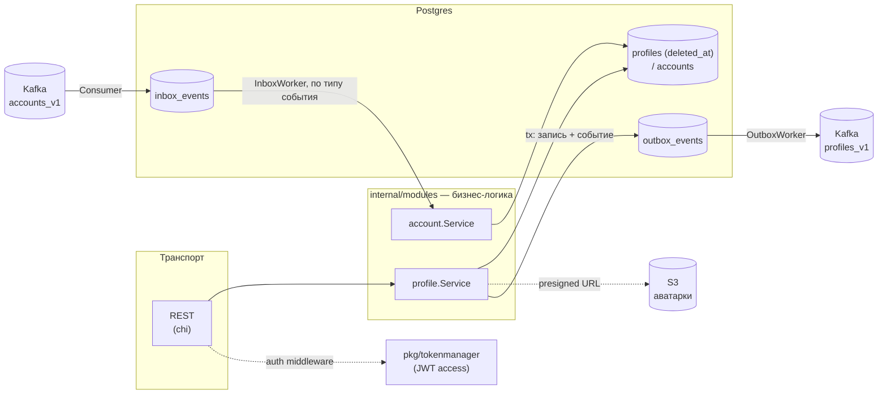

# Архитектура profiles-svc

Этот файл — живая карта проекта. Обновляем его при значимых архитектурных изменениях
(новый модуль, смена транспорта, новый внешний интерфейс), а не при каждом мелком фиксе.

## Что это

`profiles-svc` — сервис публичных профилей пользователей в микросервисной экосистеме
**netbill**. Не владеет аккаунтом (логин/пароль/роль) — это зона ответственности
`auth-svc`/`accounts-svc`; здесь только профиль (псевдоним, описание, аватар) и локальная
read-реплика базовых полей аккаунта, синхронизируемая по Kafka. Отдаёт наружу REST,
сам продюсирует и консьюмит Kafka напрямую через transactional inbox/outbox
(`netbill/eventbox`), без внешнего CDC.

## Стек

- **Go 1.25**, чистая слоистая архитектура без DI-фреймворков — сборка руками в
  `internal/build/app/run.go`.
- **Postgres** (`jackc/pgx`) — единственное хранилище: профили (soft-delete через
  `deleted_at`), локальная реплика аккаунтов, inbox/outbox таблицы.
- **Kafka** (`netbill/eventbox` поверх `kafka-go`) — сервис сам продюсер (`profiles_v1`)
  и сам консьюмер (`accounts_v1`), в отличие от auth-svc, где Kafka трогает только
  внешний CDC (Debezium), а сервис лишь пишет в outbox-таблицу.
- **REST** (chi) — единственный транспорт, gRPC/SSE нет.
- **S3** (`netbill/awsx`) — хранилище аватарок, presigned upload/preload ссылки.
- **JWT** (`netbill/restkit/tokens` + `pkg/tokenmanager`) — только проверка access-токена,
  выпускает токены `auth-svc`, здесь их не создают.
- Общие библиотеки экосистемы: `netbill/restkit` (JSON:API-рендеринг, problems, пагинация,
  токен-клеймы), `netbill/evtypes` (типы Kafka-событий), `netbill/eventbox` (inbox/outbox
  воркеры), `netbill/ape` (декларативные ошибки), `netbill/pgdbx`, `netbill/logium`.

## Структура репозитория

```
cmd/profiles-svc/        entrypoint (main.go → internal/build/cli)

internal/
  build/
    cli/                 разбор аргументов (kingpin): run service | migrate up|down |
                          events inbox|outbox cleanup
    app/                 App.Run — вся композиция зависимостей, App.MigrateUp/Down,
                          events.go — ручная очистка зависших/упавших inbox/outbox событий
    config/               LoadConfig() — конфиг целиком из env-переменных, без YAML

  api/
    rest/                chi-роутер, контроллеры, request/response мапперы, middleware
      controller/           ProfileController (get/filter/update, media upload links)
      requests/, responses/ парсинг запросов и сборка oapi.*-моделей (JSON:API)
      middlewares/          AccountAuth (JWT), CORS, Logger, ResolverUrl (avatar URL)
      scope/                контекст запроса (логгер, актор из JWT)

  modules/                бизнес-логика, транспорт-агностична
    profile/                  чтение/поиск/обновление профиля, аватар (media.go)
    account/                  локальная реплика аккаунта: Create/UpdateUsername/Delete,
                               гейтит события через profile.IsDeleted и каскадно правит profile

  repo/
    pg/                   Postgres-репозитории на чистом pgx (без query-builder):
                          AccountRepo, ProfileRepo

  messenger/              Kafka-обвязка поверх netbill/eventbox
    producer.go, consumer.go   продюсер (profiles_v1) и консьюмер (accounts_v1)
    inbox_worker.go, outbox_worker.go   поллинг-воркеры с ретраями/бэкоффом
    publisher/                  пишет доменные события в outbox в той же транзакции,
                                 что и сама операция
    handler/                    маршрутизация входящих событий на account.Service

  media/                  S3: presigned upload/preload ссылки, resolver для отдачи URL
  errx/                   декларативные доменные ошибки (via netbill/ape)
  models/                 доменные модели (Account, Profile, UploadMediaLink)

pkg/                      переиспользуемые, не завязанные на internal-домен пакеты
  tokenmanager/            парсинг JWT access-токена (issuer + secret)
  oapi/                    generated — Go-типы из OpenAPI-схемы (не редактировать руками)
  log/                     структурный логгер

migrations/schema/        SQL-миграции (rubenv/sql-migrate): accounts/profiles,
                           inbox_events/outbox_events
docs/
  rest/                    OpenAPI-спека (docs/rest/api.yaml + spec/**), Swagger UI, сгенерённый
                            Go-клиент в docs/rest/web (не путать с pkg/oapi — серверными типами)
  architecture.md          этот файл
deployment/
  Dockerfile, docker-compose.yml   сборка образа + локальный профиль (сервис + Postgres +
                                    Swagger UI; Kafka — общий брокер экосистемы, здесь не поднят)
```

## Слои и поток запроса



## Транспорты

- **REST** — `internal/api/rest/server.go`, роуты под `/profiles-svc/v1/profiles`. Ответы —
  JSON:API-конверт (`{"data": {...}}` / `{"errors": [...]}`) через `netbill/restkit/render`.
  Публичные без авторизации: `GET /`, `GET /@{username}`, `GET /{account_id}`. Под
  `AccountAuth`: `GET|PATCH /me`, `POST|DELETE /me/media`.
  OpenAPI-спека — `docs/rest/api.yaml` (+ `spec/**`), генерация Go-типов в `pkg/oapi` —
  `make generate-models` (нужны `swagger-cli`, `java` + `~/openapi-generator-cli.jar`).
- gRPC/SSE — нет, только REST.

## Ключевые механизмы

### Kafka напрямую через eventbox (не Debezium)

В отличие от auth-svc (сервис пишет только в outbox-таблицу, доставку в Kafka берёт на
себя внешний Debezium/CDC), `profiles-svc` сам является Kafka-клиентом в обе стороны:

- **Продюсер** (`internal/messenger/producer.go`, топик `profiles_v1`): `profile.Service`
  и `account.Service` через `publisher.Publisher` пишут событие в `outbox_events`
  **в той же транзакции**, что и сама доменная операция (`internal/messenger/publisher`).
  Фоновый `OutboxWorker` (`outbox_worker.go`) поллит таблицу и публикует в Kafka с
  ретраями/бэкоффом (`min/max_next_attempt`, `max_attempts` — всё конфигурируется).
- **Консьюмер** (`consumer.go`, топик `accounts_v1`): читает события жизненного цикла
  аккаунта из `accounts-svc`, складывает их в `inbox_events`. Фоновый `InboxWorker`
  (`inbox_worker.go`) поллит таблицу и маршрутизирует по типу события
  (`AccountCreated`/`AccountDeleted`/`AccountUsernameUpdated`) в
  `internal/messenger/handler` → `account.Service`.

Оба направления — poll-based воркер-пулы (`routines`/`slots`/`batch_size`/`sleep`),
а не push, что даёт ретраи с бэкоффом и идемпотентность (attempts, next_attempt_at)
"бесплатно" на уровне таблиц `inbox_events`/`outbox_events` (см. `migrations/schema/001_events.sql`).

### Локальная реплика accounts — не источник правды

`accounts` в этой БД — read-only зеркало полей (`username`, `role`, `version`) из
accounts-svc, обновляемое исключительно Kafka-событиями, не REST-запросами напрямую.
Профиль (`profiles`) создаётся автоматически при получении `AccountCreated`
(`account.Service.Create` создаёт и account-реплику, и profile в одной транзакции).
Строка `accounts` никогда не удаляется и не переиспользуется под другой ID — состояние
"удалён" целиком живёт в `profiles.deleted_at` (см. ниже), поэтому у `accounts.username`
больше нет `UNIQUE` (мёртвая реплика после удаления всё равно не участвует ни в каких
выборках по имени — `GetByUsername` есть только у `profiles`).

### Soft-delete через `profiles.deleted_at` — защита от неупорядоченной доставки

Раньше эту роль играла отдельная таблица `tombstones`; теперь то же самое даёт
`profiles.deleted_at` (`ProfileRepo.IsDeleted`, `internal/repo/pg/profiles.go`).
`account.Service.Create`/`UpdateUsername` проверяют `profile.IsDeleted` до применения
события — если `AccountDeleted` пришёл раньше (или гонка) отставшего/передоставленного
`AccountCreated`/`AccountUsernameUpdated`, событие молча отклоняется вместо
"воскрешения" удалённого аккаунта. `UpdateUsername` дополнительно защищён по версии
(`if account.Version >= params.Version { return nil }`) — устаревшее/повторное событие
просто игнорируется. `account.Service.Delete` сам не трогает `accounts` — только
`profile.Delete` (soft-delete), чего достаточно: строка `profiles` не исчезает, а
`deleted_at`/анонимизированный `username` остаются постоянной меткой для будущих
проверок `IsDeleted`. `username` при этом заменяется на `deleted_user<rand20hex>`
(влезает в `VARCHAR(32)`), чтобы освободить реальное имя под возможное переиспользование
— тот же приём, что у `accounts.username` в auth-svc.

### Аватарки — S3 presigned upload flow

`POST /me/media` возвращает presigned upload URL на временный ключ (`internal/media`).
После загрузки клиент передаёт этот ключ в `PATCH /me` (`avatar_key`); `profile.Service.Update`
валидирует загруженный файл через `awsx.ImageValidator` (формат/размер/разрешение —
целиком из env, `S3_MEDIA_PROFILE_AVATAR_*`), переносит его на финальный ключ и удаляет
предыдущий аватар, если он был. Пустая строка в `avatar_key` при обновлении — сигнал
"снять аватар". Middleware `ResolverUrl` проставляет базовый URL к `avatar_key` в исходящих
ответах, в БД хранится только ключ.

### Аутентификация

Только проверка access-токена (`pkg/tokenmanager.ParseAccountAuthAccess`) в middleware
`AccountAuth` — выпуск/refresh токенов не здесь, этим занимается `auth-svc`. Роль из
клеймов кладётся в `scope` контекста запроса и используется для ролевых ограничений
роута (`AccountAuth(allowedRoles...)`), хотя на сегодня используется без ограничения ролей.

### Конфигурация

Только env-переменные (`internal/build/config/config.go`, см. `.env.example`), без YAML.
Обязательные (паника при отсутствии): `DATABASE_SQL_URL`, `AUTH_TOKENS_ACCOUNT_ACCESS_SECRET_KEY`,
`S3_AWS_REGION`, `S3_AWS_BUCKET_NAME`, `S3_AWS_ACCESS_KEY_ID`, `S3_AWS_SECRET_ACCESS_KEY`,
`S3_AWS_BASE_URL`, `KAFKA_BROKERS`. Всё остальное — опционально, дефолты и полный список —
в `.env.example`.

## Известные пробелы (актуально на момент написания)

- **Тестов нет вообще** — ни юнит-, ни интеграционных (сознательно отложено).
- **Observability отсутствует** — ни метрик, ни трейсинга (в отличие от auth-svc, где есть
  `internal/observability`).
- **Кэша нет** — каждый читающий запрос идёт в Postgres напрямую.
- **Kafka не поднят в `deployment/docker-compose.yml`** — предполагается общий брокер
  экосистемы на сети `netbill-net`, здесь не описан.
- **Нет фоновой очистки старых soft-deleted профилей** — `profiles` со временем копится
  мёртвыми строками; если объём когда-нибудь станет проблемой, потребуется отдельный
  cron/job на архивацию или физическое удаление давно удалённых записей.

## Как поднять локально

```
cp .env.example .env      # заполнить секреты + KAFKA_BROKERS на реальный/общий брокер
make docker-up              # profiles-svc + postgres + swagger-ui
# или без докера:
make migrate-up
make run-server
```

Регенерация OpenAPI-типов после правок API:
```
make generate-models   # docs/rest/api.yaml → docs/rest/api-bundled.yaml + pkg/oapi
                        # (нужны java, swagger-cli, ~/openapi-generator-cli.jar)
```
